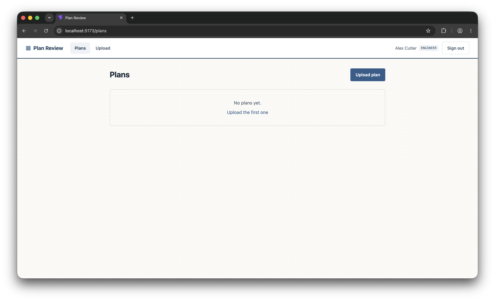

# AI-Subdivision-Plan-Review-FastAPI-React

A subdivision plan reviewing tool that incorporates AI to help city engineers quickly review basic information of subdivision plans to make sure major plan issues are resolved.  This project uses FastAPI for the backend, ReactJS and TailWindCSS for the front-end, and PostgreSQL for the database.

## Features

- Allow engineers to upload PDFs for analysis and store those files with the results
- Allow the tool to parse and analyze uploaded PDFs
- Implement authentication/authorization
- Calls external APIs or implement CRUD actions for zoning law data
- Also implement CRUD actions on uploaded plan files

## Screenshots



## Database Design/Structure

**Users**

- ID (UUID primary key)
- First Name (string)
- Last Name (string)
- Username (string)
- Email (string)
- Password (string)
- Status (enum (engineer or admin))

**Plans**

- ID (UUID primary key)
- User ID (UUID foreign key)
- Title (string)
- File (PDF)
- AI review notes (either text or JSON)

## Example JSON Schema Output

```json
{
  "review_version": "1.0",
  "reviewed_at": "2026-07-06T14:22:00Z",
  "model": "claude-sonnet-4-6",
  "overall_status": "pass_with_notes",
  "confidence": "high",
  "summary": "Single-family residential site plan showing proposed dwelling, driveway, and utility connections on a 7,500 sq ft corner lot.",
  "jurisdiction": "City of Springfield – Title 18 Zoning Code",
  "findings": [
    {
      "id": "F-001",
      "category": "setback",
      "description": "Side yard setback appears to be 4 ft; minimum required in R-1 zone is 5 ft.",
      "code_reference": "§18.40.050(B)",
      "location_description": "East property line, mid-parcel",
      "page": null
    },
    {
      "id": "F-002",
      "category": "notation",
      "description": "No benchmark or datum elevation noted on grading plan.",
      "code_reference": "§16.20.030",
      "location_description": null,
      "page": null
    }
  ],
  "drawing_metadata": {
    "drawing_type": "site plan",
    "scale_detected": "1\" = 20'",
    "north_arrow_present": true,
    "legend_present": false
  }
}
```